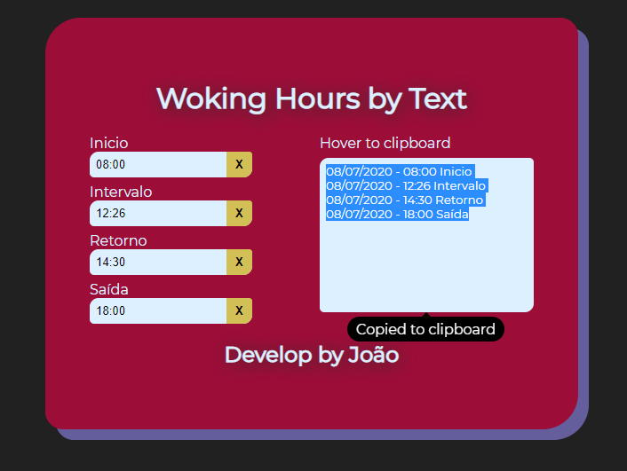

# working-hours-by-text [View on Heroku](https://working-hours-text.herokuapp.com/)
Aplicação simples para gerar o horário diário para texto

<i>Simple application to generate daily schedule for text</i>



## Project setup
```
yarn install
or
npm install
```

### Compiles and hot-reloads for development
```
yarn serve
or
npm run serve
```

### Compiles and minifies for production
```
yarn build
or
npm run build
```

### Lints and fixes files
```
yarn lint
or
npm run lint
```
### Run on node server (default port 5000 or port set in the environment)
```
yarn start
or
npm start
```
